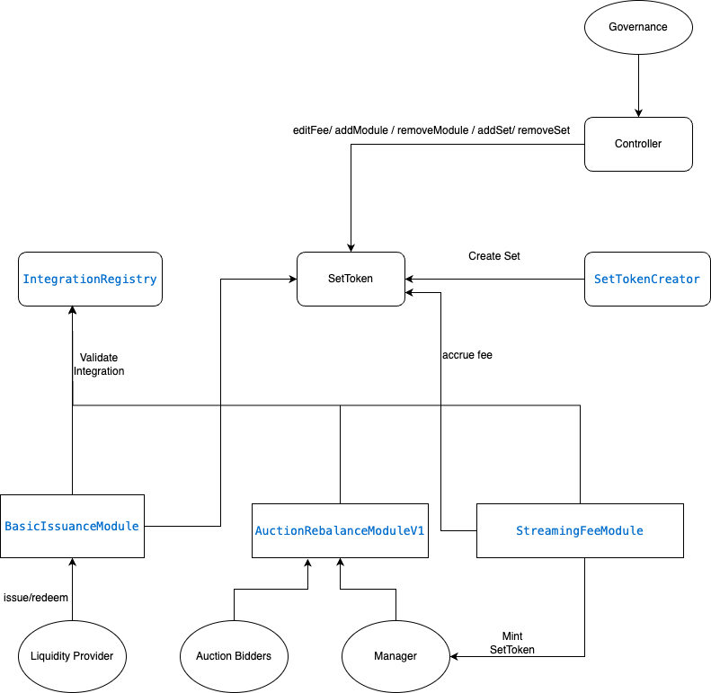

# crypdex

Index token collateralized as a weighted basket of tokens.

# Note
This is a fork of the [index coop smart contracts](https://github.com/IndexCoop/index-protocol).
We've only kept the contracts that we need for this project. 
We've re-written the tests in foundry for the sake of our understanding and to also show that this not a blind fork.


# Testing
After cloning the repository, make sure that all the github modules have been updated
```
git submodule update --init
```
To run the tests run:  
```
forge test -vvv
```
To run fork tests
```
FOUNDRY_PROFILE="fork" forge test -vvv --fork-url https://eth-mainnet.g.alchemy.com/v2/<token>
```

# Smart Contracts

### Protocol contracts
- [SetToken](./Contracts/protocol/SetToken.sol): ERC20 token that allows modules to be added to it that can make changes to its positon through the invoke function. It also holds the components of the index token as collateral. 
- [SetTokenCreator](./Contracts/protocol/SetTokenCreator.sol): Factory contract to create index tokens.
- [PriceOracle](./Contracts/protocol/PriceOracle.sol): Contract that returns the price for any given asset pair. Price is retrieved either directly from an oracle, calculated using common asset pairs, or uses external data to calculate price.
- [SetValuer](./Contracts/protocol/SetValuer.sol): returns the valuation of SetTokens using price oracle data used in contracts.
- [IntegrationRegistry](./Contracts/protocol/IntegrationRegistry.sol): The IntegrationRegistry holds state relating to the Modules and the integrations they are connected with.
- [Controller](./Contracts/protocol/IntegrationRegistry.sol): Contract used to add or remove sets, modules, factories, price oracles, and edit protocol fee configurations.

### Modules
Modules are contracts that have priviledges to invoke calls to the SetToken.

- [BasicIssuanceModule](./Contracts/modules/IntegrationRegistry.sol): Module that is used to issue and redeem set tokens. 
- [AuctionRebalanceModuleV1](./Contracts/modules/AuctionRebalanceModuleV1.sol): Module that allows manager to rebalance sets through an auction. Manager are EOA's or multisigs that have priviledges to rebablance sets.
- [StreamingFeeModule](./Contracts/modules/StreamingFeeModule.sol): Module that accrues fees for set Manager. It issues set tokens to the manager by diluting the the existing collateral using the position multiplier.

### Libraries
The [lib](./Contracts/lib/) directory has miscellaneous libraries that act as helpers for the math, data structures, etc used the smart contracts in this repo.

### Interfaces
The [interfaces](./Contracts/interfaces/) directory has all the interface contracts.

### auction-pricing
The [auction-pricing](./Contracts/auction-pricing/) has adapeters that are used by `AuctionRebalanceModuleV1` module to calculate the price of the components in the auction.

- [ConstantPriceAdapter](./Contracts/auction-pricing/ConstantPriceAdapter.sol): Uses `price = initialPrice` to price the components.
- [BoundedStepwiseLogarithmicPriceAdapter](./Contracts/auction-pricing/BoundedStepwiseLogarithmicPriceAdapter.sol): returns a price that increases or decreases logarithmically in steps over time, within a bounded range.
- [BoundedStepwiseLinearPriceAdapter](./Contracts/auction-pricing/BoundedStepwiseLinearPriceAdapter.sol): returns a price increases or decreases linearly in steps over time, within a bounded range.
- [BoundedStepwiseExponentialPriceAdapter](./Contracts/auction-pricing/BoundedStepwiseExponentialPriceAdapter.sol): returns a price that increases or decreases exponentially in steps over time, within a bounded range.

# Architecture Diagram

